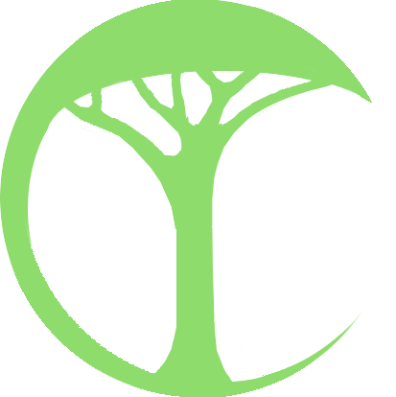
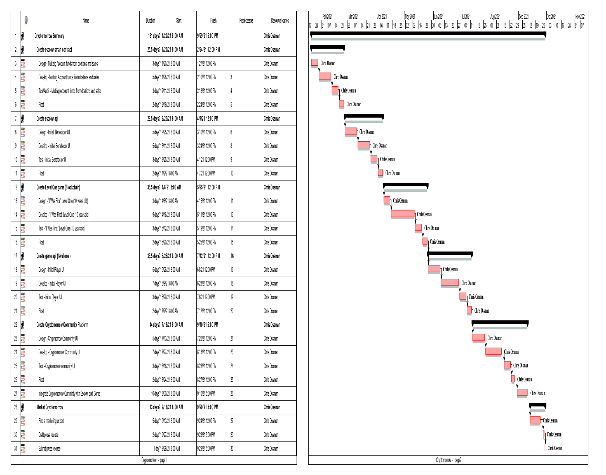
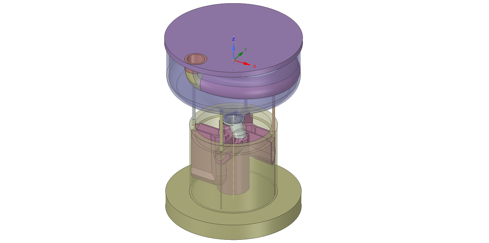
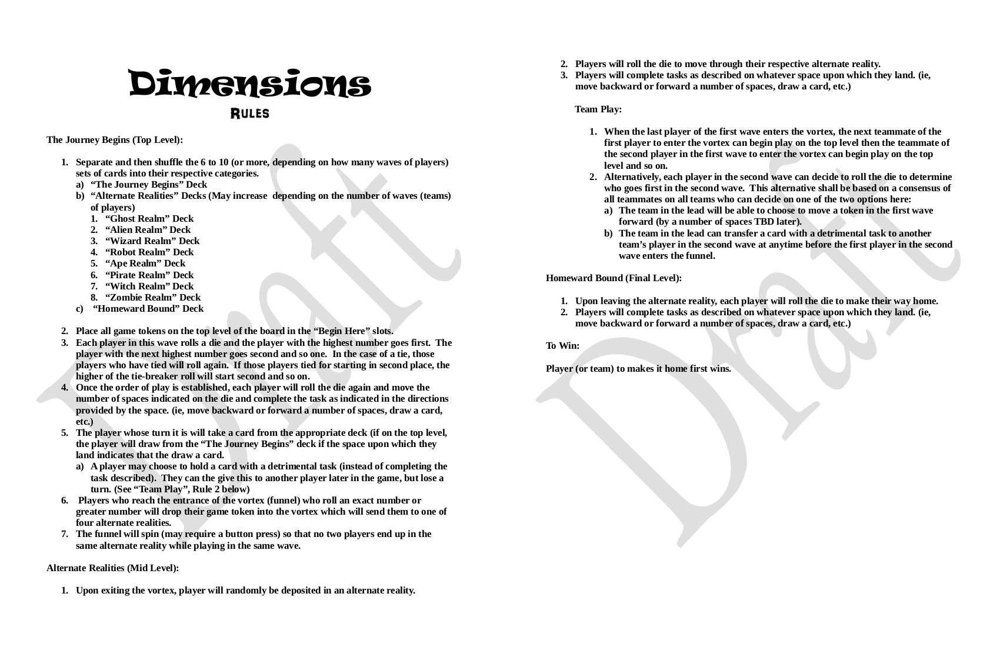
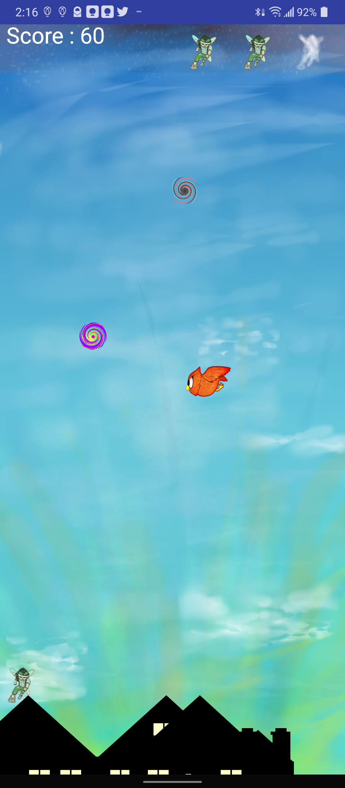
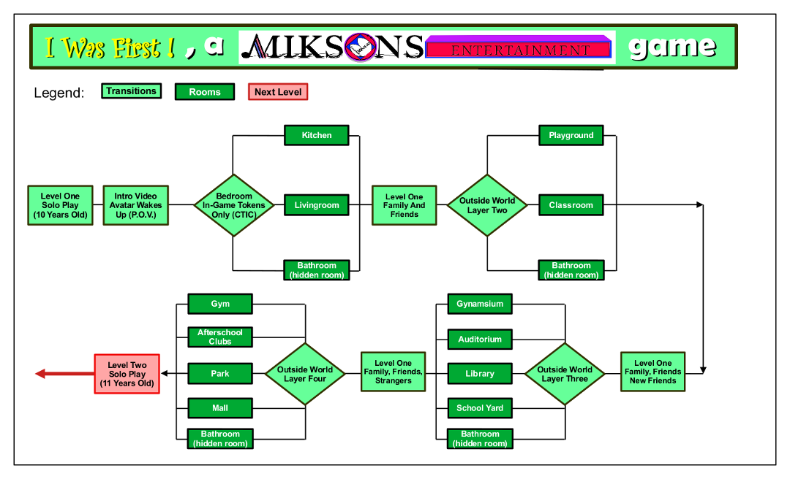

# Overview
---
## Description
The scope of Cryptomorrow is to onboard and educate the next generation of cryptocurrency users through the use of games, books, music and any other form of entertainment that can be created, bought and traded on a blockchain network. Kids under the age of 18 (eighteen) will have to attain a parent or guardian's permission to play the game. Cryptomorrow, however is not just about games as it will also seek to encourage and educate the next generation about cryptocurrency, while also mitigating the issues that centralized monetary systems have created, are creating and will create. See the following link: https://duckduckgo.com/?q=the+threat+of+fiat+currencies&atb=v231-1&ia=web

## Goals
1) Cryptomorrow will seek to incentivize the next generation of blockchain and cryptocurrency users. In this effort, Cryptomorrow will create games for kids under the age of 18 (eighteen) years that incentivize players with in-game tokens (CTIG) that mature into real-world tokens (ADA) once the player reaches the age of 18 (eighteen) years.

2) Cryptomorrow will seek to develop a Cryptomorrow Community that will set up, maintain and monitor an escrow account on a blockchain that will be made available to those players turning 18 (eighteen) years of age.

A) The escrow account will be funded through the sell of goods and services made available on a separate platform (an opensource version of Amazon, Etsy, etc.).

B) Content creators, service providers or vendors will be incentivized to sell on the platform because of the exposure their product(s) or service(s) will receive on the platform. Content providers will be given the choice of paying to list their intellectual property, real estate, etc. on the platform at a discounted rate or list it on consignment. If listed on consignment, percentage every sell (which will be greater than the cost of paying upfront fees) will go to fund the escrow account responsible for the conversion from in-game tokens (CTIG) to real-world tokens.

3) Through a governance token (CTGT), the Cryptomorrow Community will maintain a balance between the in-game tokens (CTIG) and the real-world tokens to insure an equitable payout for those players who turn 18 (eighteen) years old and any players turning 18 (eighteen) years of age in subsequent years. It is the goal of Cryptomorrow to insure that those players who turn 18 (eighteen) years old before other players are not allowed to convert an amount of real-world tokens that would set up a real-world imbalance in token distribution amongst Cryptomorrow players. In other words, Cryptomorrow will seek out an equality of opportunity for all of its players.

4) Through the Cryptomorrow governance token (CTGT), the Cryptomorrow Community will consider and vote on proposals for an equitable means to convert the in-game tokens (CTIG) available to those players who turn 18 (eighteen) years of age. Possible proposals could include (but are not limited to) the following:

A) The equitable means of conversion could be made possible through the use of weighting the value of the real-world token against the projected value of the real-world token used for conversion. In this scenario, the player might be given to the option to convert at 18 (eighteen) years old or postpone the conversion to a specified date with some incentivizing mechanism in place.

B) The in-game tokens (CTIG) might include a means to burn tokens as a way to increase the value of the in-game tokens (CTIG), so that when players reach 18 (eighteen) years of age they may receive more real-world tokens than those players who turned 18 (eighteen) years old in previous years.

Note - Both of these methods of making in-game to real-world token conversions equitable would not only have to be more fully defined, but also voted upon by the Cryptomorrow Community.

5) Cryptomorrow will contain age-appropriate levels of game play and to insure that players stay within their age-appropriate level, they will be incentivized through birthday bonuses and/or other perks that unlock subsequent levels in the game.

6) To insure that a player started playing Cryptomorrow while under the age of 18 (eighteen) years old, there will be some mechanism for the player to prove their age once they turn 18 (eighteen). The mechanism by which a player proves their age will be determined by proposals set forth and agreed upon by the Cryptomorrow Community. If the player cannot prove their age in a timeframe determined by the Cryptomorrow Community, that player's in-game (CTIG) tokens will be burned. This burning of invalidated in-game tokens (CTIG) will have the effect of increasing the value of all other in-game (CTIG) tokens that remain in the Cryptomorrow ecosystem. There will be a means to alert all players of the increase in the value of their in-game (CTIG) tokens, due to the burning of the invalidated in-game tokens (CTIG) as described above.

* The items listed above will be refined as the primary scope of this proposal with the three main components (Cryptomorrow Community, Cryptomorrow exchange/escrow smart contract and Cryptomorrow game for younger gamers) designed and developed. Testing may begin under this proposal but will not be finalized under the Project Catalyst Fund3. The majority of funds procured under Fund3 will be used to further design the components listed above and develop the smart contracts and token necessary for the project. Other funds will be used to build a team of developers and marketing professionals to expose Cryptomorrow to kids who will play the games and the benefactors who want to secure the future of their beneficiaries. It is the goal of Miksons Entertainment, LLC to create a co-op where all team members have the same rights when deciding the direction of the company and are compensated in an just and fair manner.

---

## Mission/Vision Statements and Responsibilities (Draft) for the Cryptomorrow ecosystem

---

# **Proposed Cryptomorrow In-Game Token Symbol**

# **Proposed Cryptomorrow Reinvestment Token Symbol**

---

# **Cryptomorrow Flow Chart**

---

# **Cryptomorrow Fund3 Schedule**
  ___Click on image of schedule to enlarge then use the slider below the schedule image to view.___

---

# **Examples of items to be sold to fund in-game token to real-world token conversion escrow account**

The Cryptomorrow escrow account will be funded by the sell of NFTs (digital art, animation, music, photography, etc.). The escrow account will be verified and monitored by the Cryptomorrow Community. This account could also be funded by benefactors who choose to donate to the player(s) of their choice in the form of a trust fund. There will be a fee associated with the trust fund to provide an additional revenue source for the escrow fund.

### **ART: The Gallowry**

---

### **Board Games: Dimensions (a multi-level, multi-player game with a randomized mechanical board/tower)**

#### **Prototype mechanical multi-level board**

#### **Draft rules for the multi-level board game "Dimensions"**

---

### **Books**

#### *If you are uncomfortable clicking on links, visit the Google Play Store and search for the following "Chris Ossman Far Beyond" or "Chris Ossman Far Solutions" (without the quotes).

Android App version of the book "Solutions: Enough complaining. Let's fix America"
https://play.google.com/store/apps/details?id=com.solutions.miksonsentertainment.solutions

#### ___This App also contains an example of the games that will be provided to younger players when the Cryptomorrow Dapp is initially rolled out.  This game is intentionally simple as games for older users will be progressively more complex, requiring more design, development and testing.___

Android App version of the children's book "Far Beyond" which also contains 3 (three) levels of a story-themed game.
https://play.google.com/store/apps/details?id=com.miksonsentertainment.farbeyond

---

# **Cryptomorrow example game (Level One: 10 year old)**

#### *If you are uncomfortable clicking on links, visit the Youtube.com and search for the following "Far Beyond Game Marketing" (without the quotes).

#### **Far Beyond game screenshot**

#### **Link to Far Beyond demo video**
https://www.youtube.com/watch?v=bZ0go7uJoE0

---

**Another game to be developed for various levels (ages):  "I Was First"**

In the is game the player will advance by solving progressively harder puzzles.  The pplayer will move from his or her bedroom where they will be playing solo.  Once out of their bedroom, the player will move to a room (livingroom, kitchen, etc.) where they can play against friends and/or family).  Once a player figures out all of the puzzles in the (livingroom, kitchen, etc.) they will move to a larger space (auditorium, gymnasium, playground, etc) where they can play against friends, family or even people they don't know.  

The point of the game is to be the first to leave the room by solving the room's final puzzle.  It will be like a virtual escape room and will serve as a means to educate children about aspects of cryptocurrency like blockchain mining.

The rooms and puzzles will be age-appropriate as the prizes and puzzles will be more complex and geared towards players of various ages.

**Flow chart for level one of the game "I Was First!"**

---

#### **Another game to be developed for various levels (ages): "This or That"**
#### **Flow chart for the game "This or That" coming soon.**

The simpified rules for "This or That" are as follows:

This or That (2 – 10 players (maybe more))
Equipment (game pieces, dice, cards, board (with levels)
Game Play:
1. Active player draws a card from the “choices” pile
2. Active player picks one of two, three four (TBD) choices on the card
3. The player sitting opposite the Active player (Opposing Player) picks a card from the “Consequences” pile
4. The Active player rolls the dice to determine the consequence of their choice.
5. The Opposing player reads aloud the consequence associated with the number on the dice rolled by the Active player
6. The game lasts until a player lands in the winners circle or whatever it will be called (TBD)
