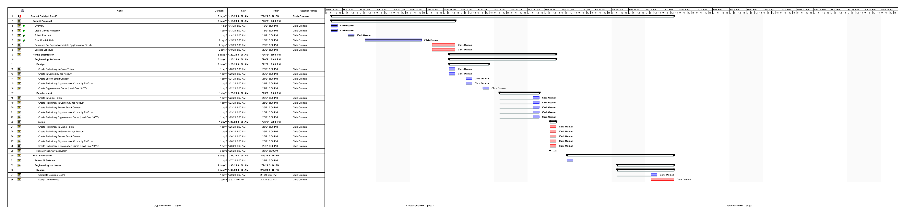

# Overview
---
## Description
The scope of Cryptomorrow is to onboard and educate the next generation of cryptocurrency users through the use of games, books, music and any other form of entertainment that can be created, bought and traded on a blockchain network.  Kids under the age of 18 (eighteen) will have to attain a parent or guardian's permission to play the game.  Cryptomorrow will not only seek to encourage and educate the next generation about cryptocurrency, but also mitigate the issues that centralized monetray systems have created, are creating and will create.  See the following link:  https://duckduckgo.com/?q=the+threat+of+fiat+currencies&atb=v231-1&ia=web

## Goals
1)  Cryptomorrow will seek to incentivize the next generation of blockchain and cryptocurrency users.  In this effort, Cryptomorrow will create games for kids under the age of 18 (eighteen) years that incentivize players with in-game tokens (CTIG) that mature into real-world tokens (ADA) ocne the player reaches the age of 18 (eighteen) years.

2)  Cryptomorrow will seek to develop a Cryptomorrow Community that will set up, maintain and monitor an escrow account on a blockchain that will be made available to those players turning 18 (eighteen) years of age.
    A)  The escrow account will be funded through the sell of goods and services made available on a seperate platform (an opensource version of Amazon, Etsy, etc.).
    B)  Content creators, service providers or vendors will be incentivized to sell on the platform because of the exposure their product(s) or service(s) will receive on the platform.  Content providers will be given the choice of paying to list their intellectual property, real estate, etc. on the platform at a discouunted rate or list it on consignment.  If listed on consignment, percentatge every sell (which will be greater than the cost of paying upfront fees) will go to fund the escrow account responsiple for the conversion from in-game tokens (CTIG) to real-world tokens.

3)  Through a governance token (CTGT), the Cryptomorrow Community will maintain a balance between the in-game tokens (CTIG) and the real-world tokens to insure an equitable payout for those players who turn 18 (eighteen) years old and any players turning 18 (eighteen) years of age in subsequent years.  It is the goal of Cryptomorrow to insure that those players who turn 18 (eighteen) years old before other players are not allowed to convert an amount of real-world tokens that would set up a real-world imbalance in token distribution amongst Cryptomorrow players. In other words, Cryptomorrow will seek out an equality of opportunity for all of its players. 

4)  Through the Cryptomorrow governance token (CTGT), the Cryptomorrow Community will consider and vote on proposals for an equitable means to convert the in-game tokens (CTIG) available to those players who turn 18 (eighteen) years of age.  Possible proposals could include (but are not limited to) the following:
    A)  The equitable means of conversion could be made possible through the use of weighting the value of the real-world token against the projected value of the real-world token used for conversion.  In this scenario, the player might be given to the option to convert at 18 (eighteen) years old or postpone the conversion to a specified date with some incentivizing mechanism in place.
    B)  The in-game tokens (CTIG) might include a means to burn tokens as a way to increase the value of the in-game tokens (CTIG), so that when players reach 18 (eighteen) years of age they may receive more real-world tokens than those players who turned 18 (eighteen) years old in previous years.
Note - Both of these methods of making in-game to real-world token conversions equitable would not only have to be more fully defined, but also voted upon by the Cryptomorrow Community.

5)  Cryptomorrow will contain age-appropriate levels of game play and to insure that players stay within their age-appropriate level, they will be incentivized through birthday bonuses and/or other perks that unlock subsequent levels in the game.

6)  To insure that a player started playing Cryptomorrow while under the age of 18 (eighteen) years old, there will be some mechanism for the player to prove their age once they turn 18 (eighteen).  The mechanism by which a player proves their age will be determined by proposals set forth and agreed upon by the Cryptomorrow Community. If the player cannot prove their age in a timeframe determined by the Cryptomorrow Community, that player's in-game (CTIG) tokens will be burned.  This burning of invalidated in-game tokens (CTIG) will have the effect of increasing the value of all other in-game (CTIG) tokens that remain in the Cryptomorrow ecosystem.  There will be a means to alert all players of the increase in the value of their in-game (CTIG) tokens, due to the burning of the invalidated in-game tokens (CTIG) as described above.

---

# **Cryptomorrow Flow Chart**

---

# **Cryptomorrow Submission Schedule**
  ***Click on Image to Enlarge***

